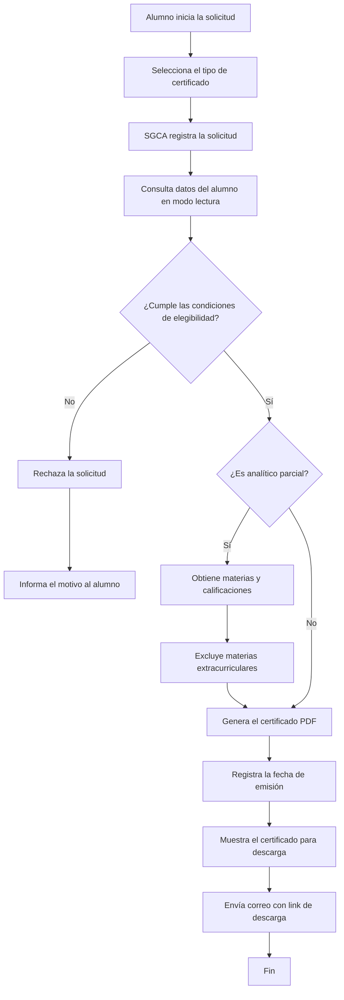

# Diagrama del proceso de solicitud de certificado

```mermaid
flowchart TD
    A[Alumno inicia la solicitud] --> B[Selecciona el tipo de certificado]
    B --> C[SGCA registra la solicitud]
    C --> D[Consulta datos del alumno en modo lectura]
    D --> E{¿Cumple las condiciones de elegibilidad?}

    E -- No --> F[Rechaza la solicitud]
    F --> G[Informa el motivo al alumno]

    E -- Sí --> H{¿Es analítico parcial?}
    H -- Sí --> I[Obtiene materias y calificaciones]
    I --> J[Excluye materias extracurriculares]
    J --> K[Genera el certificado PDF]

    H -- No --> K

    K --> L[Registra la fecha de emisión]
    L --> M[Muestra el certificado para descarga]
    M --> N[Envía correo con link de descarga]
    N --> O[Fin]
```
